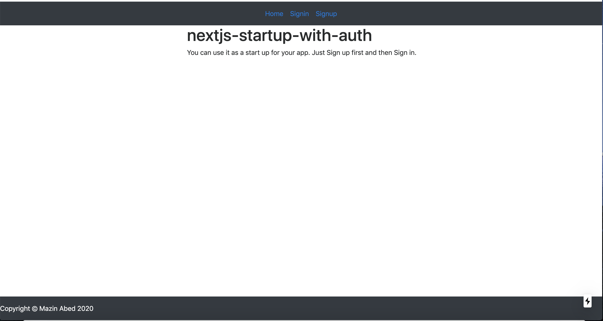

# nextjs-startup-with-auth

About
Next.js is a framework that makes it easy to create 'universal' React apps - React apps that do both client and server side rendering.

With Next.js, React pages are automatically rendered on both client and server side, without the hassle of setting up dependancies like webpack, babel or express and with automatic routing and without the constraints of projects like Create React App.

Nextjs-startup-with-auth is a starter project that provides an example of how to use Next.js without the need for  Express, instead using API for the routes (The power of Next.js).For the Authentication, this starter app is using jwt(https://jwt.io/).

This project exists to make it easier to get started and create a production app in Next.js. You are invited to use it as a reference or to copy it and use it as a base for your own projects. Contributions to improve this project are welcome.

Built with
NextJS
Sequelize
mysql

Running locally in development mode
To get started, just clone the repository and run npm install && npm run dev:
Clone the repositery.
https://github.com/mazinabed/nextjs-startup-with-auth.git

Install the dependencies in the project folder:
npm install

Then start the app in development mode:

npm run dev

Configuring
For configeration, create file name  (next.config.js). The file should look similar to below configs. 
module.exports = {
    env: {
        "username": "root",
        "password": "yourpassword",
        "database": "nextjs_db",
        "host": "localhost",
        "dialect": "mysql",
        operatorsAliases: false,
        "secretkey": "your secrectKey gose here",
    }
}

This starter is using Mysql database so create you database and create your tables (I recommend in your terminal (Node)) 
Node
const db = require('./models')
db.sequelize.sync()
This will create tables. 
